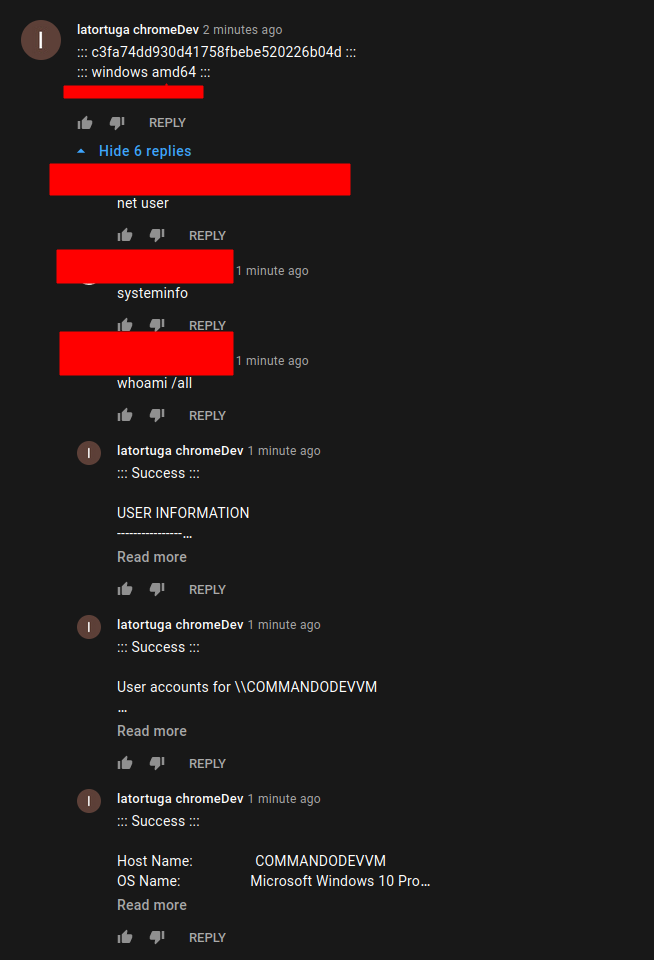
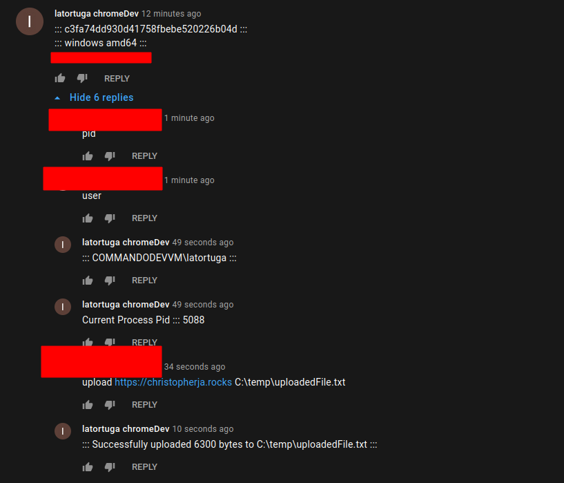
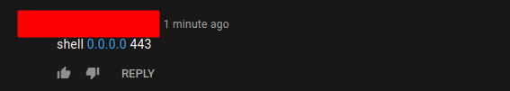
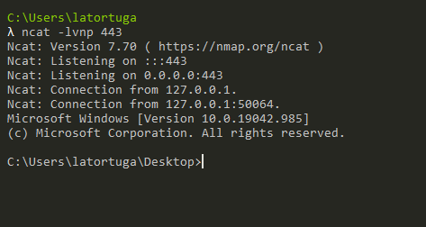

# YoutubeAsAC2

```
This was done over a weekend just to mess with youtube api.
```

## Overview
Uses youtube channel's 'discussion' tab as a way to pass messages between an implant and an operator.

Can also be used on specific videos, but chances of getting blocked by youtube for posting too many comments is high.

Heavily uses golang embed feature to embed the oauth secret and tokens into the binary. So you only need to oauth and allow app access one time. Then embed the json files.

Contains reverse tcp shell, injection and migrate commands. Migrate only possible through embedding donut shellcode of binary into binary (golang inception)

## Command list

* pid
* migrate
* inject
* user
* upload
* shell
* clear
* exit

If not above will execute shell commands

## Thoughts
This was done over a weekend just to mess with youtube api. The idea was inspired by the other novel C2 projects out there. And since youtube is in the top 5 most popular websites i decided to give it a shot.

The api quota for non verified apps is pretty low. And the discussion tab only appears in desktop version of youtube.com (if using a video mobile app can be used.)

I think this could be used for inital payload as it wont really trigger AV (migrate and inject commands will show up on defender for endpoint. not sure about reverse tcp shell command.)

Taking this further there could be potential using the live chat api, aka you start a stream and the implants comment on stream and wait for your specific replies. (Not sure if there is a quota on live chat message insert api calls.)


## What it looks like








